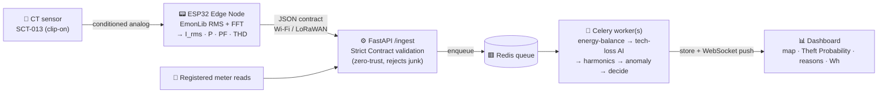
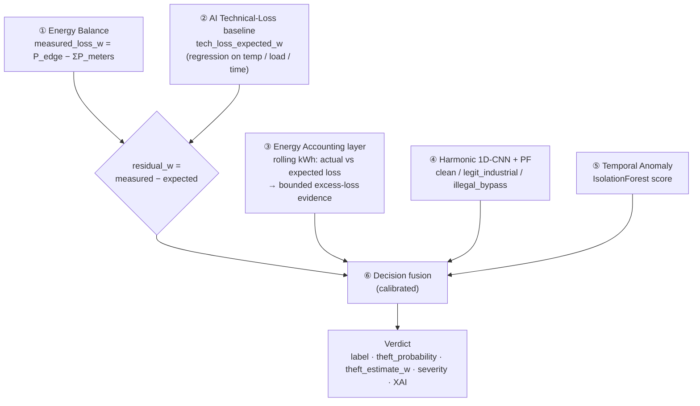

<div align="center">

# ⚡ Grid‑Pulse NTL

### Autonomous Electricity‑Theft Detector for the Distribution Grid

**An AI edge‑system that catches electricity theft — and knows the difference between real theft and the *natural* losses caused by heat and load, so it never cries wolf.**

<br/>

[](#-verified-live)
[](#-architecture)
[](#-how-detection-works)
[](#-evaluation)
[](#-the-model-is-multi-factor)
[](#-quickstart-demo-in-2-minutes)
[](#-license)

<br/>

*Kafr El‑Sheikh Hackathon · B2G climate‑&‑infrastructure play · Egypt loses **~30 billion EGP/year** to electricity theft.*

</div>

---

> **The moat, in one sentence:** an AI baseline predicts how much loss is *normal right now* (from load, temperature, and time). Only the **unexplained excess** — corroborated by power‑factor / THD and a temporal anomaly — is flagged as theft, with a **Theft Probability %** and a **reasons checklist**. That separation is the whole product: it kills the false positives that make naive "meter‑difference" alarms useless.

<br/>

## 📑 Table of contents

- [The problem](#-the-problem)
- [The solution](#-the-solution)
- [Quickstart](#-quickstart-demo-in-2-minutes)
- [The three‑beat demo](#-the-three-beat-demo)
- [Architecture](#-architecture)
- [How detection works](#-how-detection-works)
- [The model is multi‑factor](#-the-model-is-multi-factor)
- [Evaluation](#-evaluation)
- [Explainable AI (XAI)](#-explainable-ai-xai)
- [API surface](#-api-surface)
- [Project layout](#-project-layout)
- [Verified live](#-verified-live)
- [Hardware (edge node)](#-hardware-edge-node)
- [Business case](#-business-case-b2g)
- [Roadmap](#-roadmap-phase-2)
- [Presenting](#-presenting)

<br/>

## 🔥 The problem

Electricity distribution companies bleed on **Non‑Technical Loss (NTL)** — theft: illegal direct hooks, tampered meters, unlicensed workshops, brick factories, and crypto rigs pulling unmetered power off the network. In Egypt that's an estimated **~30 billion EGP/year**, and it worsens **load‑shedding** (تخفيف الأحمال) by overloading transformers with demand nobody is billed for.

The hard part isn't *measuring* power. It's **separating theft from legitimate loss.** Cables naturally shed energy as heat, and that loss **rises with temperature and load** — Egyptian summer! A naive "meter‑difference" alarm floods operators with **false positives** and gets ignored.

<br/>

## 💡 The solution

Grid‑Pulse NTL runs a continuous **energy balance** at each distribution transformer, then uses an **AI technical‑loss baseline** to explain away the natural loss. What's left over — confirmed by harmonic distortion, power‑factor collapse, and a temporal anomaly — is **suspected theft**, localized and explained.

| Persona | Pain | What we give them |
|---|---|---|
| **Distribution company / Ministry of Electricity** (B2G) | billions lost, blind to *where* theft happens | per‑transformer theft map + evidence, few false alarms |
| **Field inspection teams** | chase random tips, waste trips | ranked, localized, time‑stamped leads |
| **Grid operations** | transformers overloaded by unmetered load | early overload + NTL signal |

<br/>

## 🚀 Quickstart (demo in 2 minutes)

```bash
cp .env.example .env
docker-compose up --build         # api :8000  +  redis  +  celery worker
python ml/train.py                # optional — the physics fallback works without a trained model
```

Open **http://localhost:8000**, pick a transformer, and drive the demo bar. No hardware required.
For a live telemetry stream: `python simulator/simulate.py`.
To run on real hardware, flash [`firmware/esp32_edge_node`](firmware/esp32_edge_node/README.md).

<br/>

## 🎬 The three‑beat demo

This *is* the product. Three buttons, three verdicts — replay them in any order, any number of times (the demo is replay‑safe).

| Button | Injected | Verdict on screen | Why it lands |
|---|---|---|---|
| **Normal load** | registered lamp only | `NORMAL` — energy balance holds | baseline sanity |
| **Hot day (technical)** | temperature rises | `TECHNICAL LOSS` — **AI baseline rises to match, no alarm** | 🏆 the false‑positive killer — judges lean in here |
| **Inject theft** | hair‑dryer on an *unregistered* outlet | `THEFT` — screen turns **red**, **Theft Probability 94%**, ✓ 5/5 reasons, ~3.1 kW estimated | the payoff |

<br/>

## 🏗 Architecture



The **edge does the DSP** (RMS, power factor, FFT/THD) so we ship *features*, not raw waveforms — tiny payloads that scale to thousands of transformers.

### Stack & rationale

| Layer | Choice | Why |
|---|---|---|
| Edge firmware | **ESP32 + C++**, EmonLib, arduinoFFT | cheap, Wi‑Fi built‑in, does RMS/FFT locally |
| Sensor (POC) | **SCT‑013‑000** + 33Ω burden + 1.65 V bias + 10 µF | current‑output CT; conditioning required before ADC |
| Ingest API | **FastAPI** + **Pydantic** (mirrors the JSON Schema) | validates the Strict Contract, rejects junk |
| Queue | **Redis** | absorbs bursts from many transformers |
| Workers | **Celery** | async AI inference — real microservices story |
| AI | **scikit‑learn** (RandomForest regressor + IsolationForest) **+ PyTorch 1D‑CNN** (harmonic classifier) | trains in seconds/minutes on physics‑seeded synthetic data; CNN degrades to a rule if torch is absent |
| Realtime | **FastAPI WebSocket** (+ poll fallback) | live red alert on stage |
| Dashboard | **single‑file** served by FastAPI | demo‑simple |
| Deploy | **docker‑compose up** | one command on stage |

<br/>

## 🧠 How detection works

Five independent steps fuse into one explainable verdict. Full detail in [`plan/02-detection-and-ai.md`](plan/02-detection-and-ai.md).



| Step | File | What it does |
|---|---|---|
| ① Energy balance | `detection/energy_balance.py` | `measured_loss_w = P_transformer_out − ΣP_registered_meters` |
| ② Technical‑loss AI | `detection/technical_loss.py` | predicts the *expected natural loss* → **residual is what matters** |
| ③ Energy accounting | `detection/accounting.py` | rolling‑window kWh: actual vs AI‑expected loss → **bounded** excess‑loss evidence (never alarms alone) |
| ④ Harmonic 1D‑CNN + PF | `detection/harmonic_cnn.py` · `harmonics.py` | classifies the current spectrum → tells a **registered high‑THD factory** apart from an **illegal hook** (degrades to a THD/PF rule if torch is absent) |
| ⑤ Temporal anomaly | `detection/anomaly.py` | catches repeating unexplained draws (e.g. 02:00–06:00 workshop hooks) |
| ⑥ Decision fusion | `detection/decision.py` | fuses the evidence → calibrated label, probability, theft estimate, reasons |

```
if residual_w ≤ margin(load):     label = NORMAL              # balance holds
elif explained_by_baseline:       label = TECHNICAL_LOSS      # residual small vs expected
else:                             label = NTL_THEFT_SUSPECTED # unexplained + corroborated
```

**Severity bands:** `info` → `low` → `medium` (5–10% unexplained) → `high` (10–25%) → `critical` (>25% or PF collapse + harmonic match).

<br/>

## 🎯 The model is multi‑factor

A reviewer warned: *if it looks like it only keys off temperature, it reads as simplistic.* So the technical‑loss regressor is trained on **seven features** — and the learned importances prove it weighs several, led by **load**, not temperature:

| Feature | Importance | |
|---|---:|---|
| `load_w` | **0.578** | `████████████████████████████` |
| `temp_c` | **0.270** | `█████████████` |
| `current_a` | **0.148** | `███████` |
| `hour` | 0.002 | `▏` |
| `dow` | 0.001 | `▏` |
| `voltage_v` | 0.001 | `▏` |
| `rated_kva` | 0.001 | `▏` |

*Trained on **8,000** physics‑seeded synthetic rows (`tech_loss ≈ k·I²·R(temp) + core_loss`). Retrains in seconds; on real utility data in production.* See [`ml/`](ml/).

A separate **1D‑CNN harmonic classifier** (`harmonic_cnn.pt`, 14 harmonic bins h=2…15) sorts the current spectrum into `clean · legit_industrial · illegal_bypass` — this is what stops a *registered* high‑THD factory from tripping the theft alarm.

<br/>

## 📈 Evaluation

Held out **600** labeled scenarios across four classes (normal · technical · industrial · theft) and scored the full fused pipeline — not just one model. Report: [`ml/artifacts/eval_report.json`](ml/artifacts/eval_report.json) (regenerate with `python ml/evaluate.py`).

| Metric | Value | Meaning |
|---|---:|---|
| **Theft precision** | **1.00** | when it cries theft, it's right — **0 false positives** (`fp = 0`) |
| **Theft recall** | 0.78 | catches 123 of 157 real thefts |
| **Theft F1** | 0.88 | balanced score |
| **False‑alarm rate on legitimate *industrial* load** | **0.0%** | 🏆 the 1D‑CNN never mistakes a real factory for a hook |
| **Brier score** (calibrated) | 0.058 → **0.053** | probabilities are *calibrated*, not just ranked |

> Precision is deliberately tuned high: inspection trips cost money, so a lead that fires must be trustworthy. Confusion matrix: `TP 123 · FP 0 · FN 34 · TN 443`.

<br/>

## 🔍 Explainable AI (XAI)

Every verdict ships a **Theft Probability %** and a **reasons checklist** — not a bare "Theft Detected." That's what earns trust from judges and inspectors.

```json
{
  "label": "NTL_THEFT_SUSPECTED",
  "theft_probability": 94,
  "measured_loss_w": 3400, "tech_loss_expected_w": 324, "residual_w": 3076,
  "reasons": [
    {"label": "Energy imbalance",            "met": true, "detail": "unaccounted +3076 W (margin 400 W)"},
    {"label": "Expected loss exceeded",      "met": true, "detail": "actual +951% vs AI baseline"},
    {"label": "Power factor dropped",        "met": true, "detail": "0.66 (healthy ≥ 0.92)"},
    {"label": "THD increased",               "met": true, "detail": "22% (alert > 10%)"},
    {"label": "Load outside normal pattern", "met": true, "detail": "anomaly 0.83"}
  ],
  "explanation": {"summary": "Theft probability 94% — ~3.08 kW unaccounted beyond natural loss",
                  "recommended": "dispatch field inspection"}
}
```

<br/>

## 🔌 API surface

Canonical contract lives in [`contracts/edge_telemetry.schema.json`](contracts/edge_telemetry.schema.json); the Pydantic models mirror it exactly.

| Method & path | Body | Returns |
|---|---|---|
| `POST /ingest` | Edge payload (**must match schema**) | `{accepted, reading_id}` · `401` bad token · `422` bad body |
| `POST /meters/reading` | `{meter_id, ts, energy_wh_interval, p_active_w}` | `{ok:true}` |
| `GET /transformers` | — | `[Transformer]` + latest verdict |
| `GET /transformers/{id}` | — | detail + recent readings + verdicts |
| `GET /transformers/{id}/history` | — | time‑series of readings & verdicts (dashboard charts) |
| `GET /verdicts?label&severity&status` | — | `[Verdict]` newest first |
| `POST /verdicts/{id}/status` | `{status}` | `Verdict` |
| `POST /sim/scenario` | `{transformer_id, scenario}` | `{ok:true}` — `normal \| technical \| theft` |
| `GET /healthz` | — | `{status:"ok"}` |
| **WS** `/ws/stream` | — | events `edge_reading` · `verdict` · `transformer_status` |

<br/>

## 📁 Project layout

```
Hackathon Kafrelsha5/
├─ plan/          strategy · architecture · detection · timeline · tasks · demo runbook
├─ contracts/     edge_telemetry.schema.json — the Strict API Contract (+ examples)
├─ firmware/      ESP32 edge node — .ino + config.h + wiring/calibration README
├─ backend/
│  └─ app/
│     ├─ main.py          FastAPI: /ingest /meters /verdicts + WS + dashboard
│     ├─ contract.py      Pydantic models == JSON Schema
│     ├─ store.py ws.py queue.py tasks.py config.py
│     └─ detection/       energy_balance · technical_loss · accounting · harmonics · harmonic_cnn · anomaly · decision
├─ simulator/     no-hardware demo + live telemetry stream
├─ ml/            datasets + training + evaluation
│  ├─ generate_dataset.py · train.py            (tech-loss regressor + IsolationForest)
│  ├─ generate_harmonics.py · train_harmonics.py (1D-CNN harmonic classifier)
│  ├─ evaluate.py                                (fused-pipeline metrics → eval_report.json)
│  └─ artifacts/  tech_loss.pkl · iforest.pkl · harmonic_cnn.pt · calibrator.pkl · *.json
├─ dashboard/     single-file ops dashboard (served at /)
├─ pitch/         index.html (web) · Grid-Pulse-NTL.pptx/.pdf · build_pptx.py
└─ docker-compose.yml · .env.example · README.md
```

<br/>

## ✅ Verified live

Proven running on real infrastructure (docker‑compose: API + Redis + Celery):

- ✔️ **Three beats classify correctly** — normal `0%`, technical `0%` (no false alarm), **theft `94%` / 5‑of‑5 reasons / ~3.08 kW unaccounted**.
- ✔️ **Contract is zero‑trust** — `/ingest` returns `401` on a bad token, `422` on a malformed body.
- ✔️ **Live WebSocket push** — every scenario emits a `verdict` over `/ws/stream`; the dashboard back‑fills from `GET /verdicts` so it looks live on open.
- ✔️ **Multi‑factor model** — feature importances confirm load `0.58` > temp `0.27` > current `0.15`.
- ✔️ **Evaluated on 600 held‑out scenarios** — theft precision `1.00`, F1 `0.88`, **0% false alarms on legitimate industrial load** (`ml/evaluate.py`).
- ✔️ **Replay‑safe** — beats run in any order; a load *drop* is never mistaken for theft.

Run the checks yourself:

```bash
docker-compose exec api python backend/tests/test_detection.py   # 3 beats + contract rejects junk
```

<br/>

## 🛠 Hardware (edge node)

POC uses an **ESP32 + SCT‑013‑000** (100 A / 50 mA, no internal burden). The current‑output CT needs conditioning before the ADC:

- **Burden** 33 Ω → calibration factor = turns/burden = 2000/33 ≈ **60.6** (EmonLib)
- **1.65 V DC bias** + **10 µF** cap to center the AC on the ESP32 ADC
- Nominal `230 V @ 50 Hz`; add a **ZMPT101B** voltage sensor to measure true PF/THD

Wiring, calibration math, and thresholds live in [`firmware/esp32_edge_node/README.md`](firmware/esp32_edge_node/README.md) and `config.h`.
**Production upgrade:** Rogowski coils on LV busbars in transformer kiosks (RMU), IP65, LoRaWAN/4G backhaul.

<br/>

## 💼 Business case (B2G)

**SaaS + Hardware‑as‑a‑Service** to distribution companies / the Ministry of Electricity.

- **Pricing:** % of *recovered* stolen energy, **or** per‑transformer monthly subscription.
- **TAM:** ~30B EGP/yr NTL in Egypt. Recovering even 10% ≈ **3B EGP**.
- **ROI:** **< 1 month per kiosk** (hardware ~$300 vs. tens of thousands EGP/month leaked per feeder).
- **Wedge:** the AI false‑positive killer → inspectors trust the leads → adoption.

<br/>

## 🗺 Roadmap (Phase 2)

Pitched as the scaling/defense roadmap — *not* built for the hackathon:

`TinyML on‑device inference (send only on theft → −99% bandwidth)` · `theft‑location triangulation across feeders` · `load‑forecasting to pre‑empt overload / load‑shedding` · `smart‑contactor auto‑cutoff` · `hardware anti‑tamper crypto` · `federated learning across regions`.

> The **1D‑CNN harmonic classifier** started as a Phase‑2 idea — it's now [built and evaluated](#-evaluation) (`harmonic_cnn.pt`, 0% false alarms on industrial load).

<br/>

## 🎤 Presenting

- **Demo runbook** — timed 90‑second script + Q&A + fallbacks: [`plan/06-demo-runbook.md`](plan/06-demo-runbook.md)
- **Pitch page / deck** — [`pitch/index.html`](pitch/index.html) · `pitch/Grid-Pulse-NTL.pptx` · `pitch/Grid-Pulse-NTL.pdf`
- **Full plan set** — [`plan/`](plan/): overview · architecture · detection & AI · 96h timeline · tasks & roles · demo/pitch · runbook

<br/>

## ⚙️ Configuration

`INLINE_DETECTION=true` (default) runs detection inside the API — simplest and demo‑safe. Set it `false` to route through the Celery worker (the microservices story); verdicts are published back over Redis pub/sub. Other knobs: `INGEST_TOKEN`, `RESIDUAL_ALERT_W` (unexplained watts before suspicion), `HEALTHY_PF`, `REDIS_URL`, and the energy‑accounting layer — `ACCOUNTING_HORIZON_H`, `ACCOUNTING_K`, `ACCOUNTING_NEUTRAL`.

<br/>

## 📄 License

Hackathon project — Kafr El‑Sheikh. All code, detection models, and simulator are original work.

<div align="center">
<br/>

**Built to make the invisible loss visible.** ⚡

</div>
